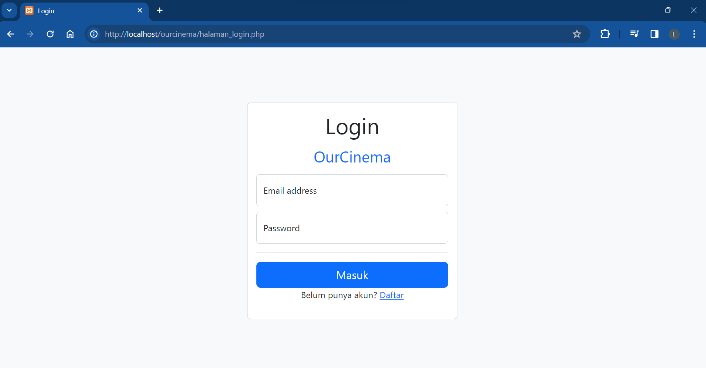
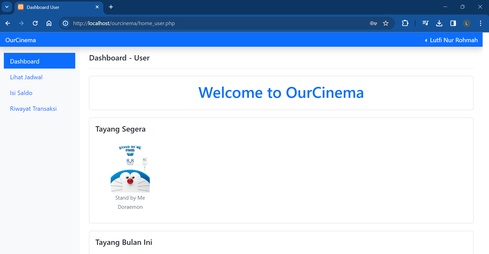
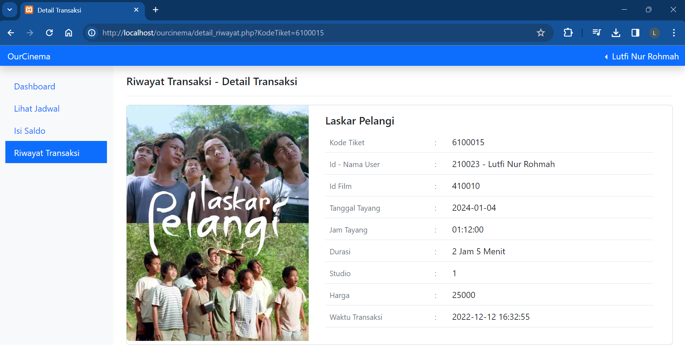
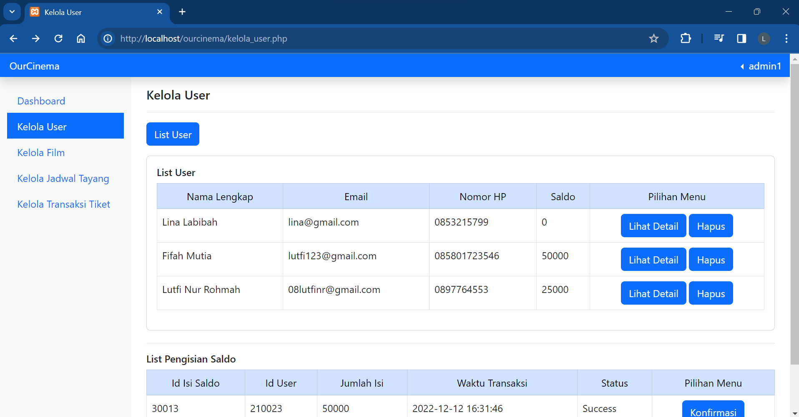
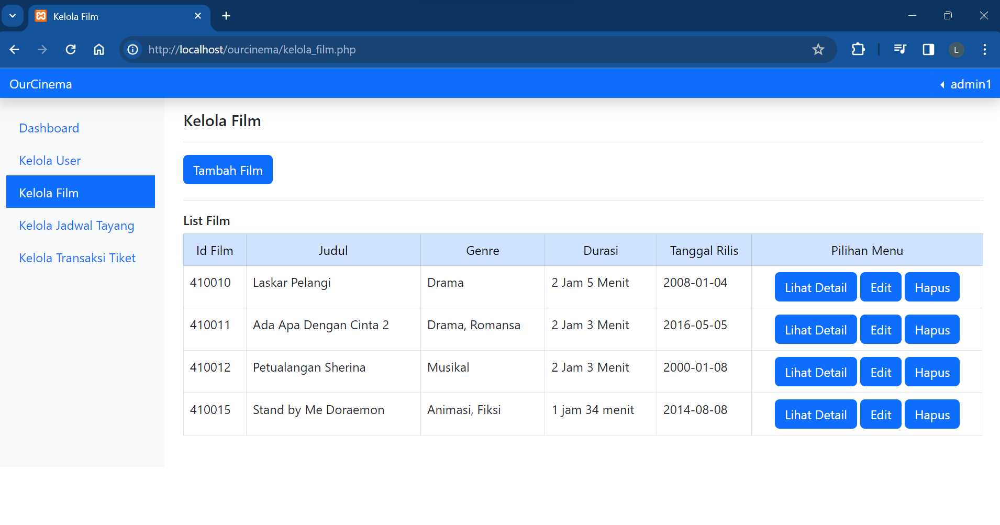

# Web OurCinema  

## Deskripsi

OurCinema merupakan aplikasi berbasis web yang digunakan untuk memudahkan pengunjung maupun admin bioskop dalam transaksi pemesanan tiket film. Melalui sistem informasi ini, pengguna dapat melihat informasi dan jadwal film yang tayang di bioskop dan dapat memesan tiket bioskop melalui website tanpa harus datang secara langsung ke bioskop. Selain itu, sistem informasi ini akan membantu admin bioskop dalam mengelola dan mengakses data film dan data transaksi pemesanan tiket bioskop. Data pada sistem informasi ini akan disimpan dalam database dengan menggunakan relasi antar tabel.

## Fitur

### 1. Admin

#### a. Login 
Admin dapat memasukkan email dan password yang telah ditentukan agar dapat mengakses fitur lainnya.

#### b.	Kelola User
Pada menu ini, admin dapat melihat data member atau pengguna seperti id member, nama lengkap, email, nomor hp, alamat, password, dan jumlah saldo. Admin juga dapat mengelola transaksi pengisian saldo member dengan melihat daftar member yang melakukan pengisian dan mengkonfirmasi bukti pembayarannya, lalu mengubah data saldo member sesuai dengan yang diisi.

#### c.	Kelola film
Pada menu ini, admin dapat menambahkan data film mulai dari id film, genre, judul, gambar, durasi, sinopsis, tanggal rilis, produser, penulis, sutradara, dan produksi. Admin juga dapat mengubah data film yang telah ditambahkan, menghapus, dan melihat daftar film yang telah ditambahkan.

#### d.	Kelola jadwal tayang
Pada menu ini, admin dapat menambahkan data jadwal tayang film di bioskop mulai dari id jadwal, nama studio, jumlah kursi, id film, tanggal tayang, jam tayang, dan harga. Admin juga dapat mengubah jadwal yang telah ditambahkan, menghapus, dan melihat daftar jadwal yang telah ditambahkan.

#### e.	Kelola transaksi tiket
Pada menu ini, admin dapat melihat data transaksi dan detail transaksi tiket yang telah dilakukan oleh pemesan tiket. Data yang dilihat berupa kode tiket, id member, id jadwal, jumlah kursi yang dipesan, nomor kursi, waktu transaksi, dan total pembayaran.

### 2.	User

#### a.	Daftar 
User yang belum terdaftar dapat memasukkan data berupa nama lengkap, alamat, email, nomor hp, password.
#### b.	Login
User dapat memasukkan email dan password yang telah ditentukan agar dapat mengakses fitur lainnya
#### c.	Lihat daftar film
Pada menu ini, user dapat melihat daftar film yang ada di bioskop dan dapat menampilkan detail film berupa genre, judul, gambar, durasi, sinopsis, tanggal rilis, produser, penulis, sutradara, dan produksi.
#### d.	Lihat jadwal
Pada menu ini, user dapat melihat jadwal penayangan film yang ada di bioskop berupa nama studio, jumlah kursi, film yang tayang, tanggal tayang, jam tayang, dan harga tiket. User dapat melakukan pemesanan tiket film sesuai jadwal yang diinginkan. 
#### e.	Isi saldo
Untuk melakukan pemesanan tiket, user harus memiliki saldo yang mencukupi. Pada menu ini, user dapat melakukan pengisian saldo sebanyak yang diinginkan dan mengirimkan bukti pembayarannya dan mengecek jumlah saldo yang dimiliki.
#### f.	Riwayat Transaksi
Pada menu ini, user dapat melihat riwayat pemesanan tiket yang telah dilakukan.
#### g.	Edit profil
Pada menu ini, user dapat melihat dan mengubah data profilnya.

## Screenshoots
|   |   |
| --------------------------------------------------- | --------------------------------------------------- |
|   |   |
|  |  |
|   |   |
|  |  |
|   |   |
